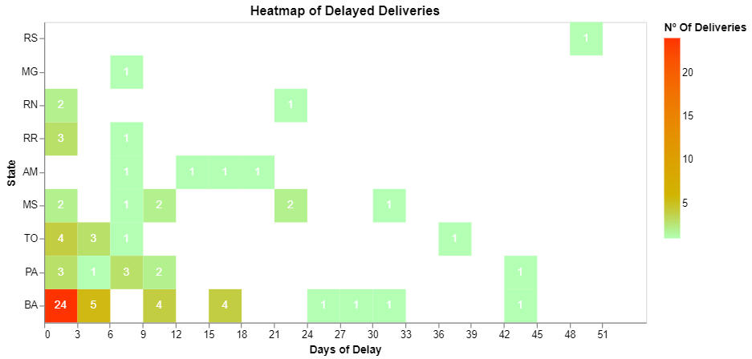

# Data Visualization using Altair

This is a repository for some of the graphs I have developped using the Altair Library. All the data here published have been completely anonymized.

All these graphs have been created using the [Python Altair](https://github.com/altair-viz/altair) Library, which is built upon the [Vega Lite](https://github.com/shadfrigui/vega-lite) Library. Vega Lite focuses on building interactive graphs using  declarative visualization grammar with JSON.

Graph 3:

