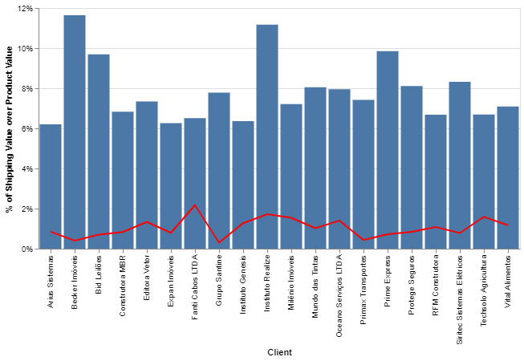

# Data Visualization using Altair

This is a repository for some of the graphs I have developped using the Altair Library and Pandas with Python. All the data here published have been anonymized before publish.

All the graphs you see bellow are created using the [Altair Library](https://github.com/altair-viz/altair), which is built upon the [Vega Lite Library](https://github.com/shadfrigui/vega-lite). Vega Lite is dava visualization library that focuses on building interactive graphs using using declarative visualization grammar with JSON, Altair is a Python wrapper of the Vega Lite library. You can learn more at the links above.

This project was created for use in my company, while also serving me as a personal challenge and a test of the library strenghts and limitations.

## Charts of Deliveries Performance 

### Chart 1 - Overview of Delayed Deliveries
This is the first chart I created, with the goal of understanding the Altair's syntax. It illustrates the volume of overdue deliveries segregated by delivery states. While this chart offers a very simplified view, it serve as a foundation for developing more intricate visual representations.

You can open this intercative Chart [Clicking here](https://vega.github.io/editor/#/url/vega-lite/N4KABGBEDGD2B2AzAlgc0gLjMSA3ZApgO6bYwIAuy8ArrDQM4DqyAJhQBakAsADLwBooceFVr0GACQJoOFUgGZ+AX2UDwUADYBDAJ4EATqQDaGiKAiWoAW20GA1qRwVdABwKlId6JCGR6FIYAStqsyIykAIwATLxqZpaQBPBwYfDoWBZWiXCasEaZCdlQKASarJ4AyhTagWAAIgQMYrXICL5F2ZBUFJoeWJDVtR7qxVbdbv1Q8LDW1NqakJ0Q8WNQnAQ1Tl6oqAYEqMOecDSivlDN2tCOWBQGNAR+Lu6eAI402qLINVS4HqtjbqwWCaKiubalcpVH4EBpNFpUdpPSaeGZzeALSDKToA8Y9PqeAByNGsACNDGBYIg4Tp9Kwacg-gZCAwwKTdGAhoEllZcdhOpBbA5ts8pt0CAAPeR+AyhcIMKJKPwMZAALymsT5ECSKVgaQy-LW5DyBUNaxKhChAy5sMazXmiPgHXN62+BOtMOd5omLwGaPmi2WYC1iUCUu22l2+0O3IGJzOyN9UHenx6rT+WNGgI2W0yOz2ByOcfoCYuNWupDuD0TYpTXx+jP+WeKQJBYIhloqHuGcPtGMd5x9Yv9GMW2OKIe6brFxLJFKpNL0BHpjU0jeZTTZHJtPMs47AAF0s5BWLVtNsMdYxaeagBaaAANgIAA5IogAKy8d8KSLcbSkyJnwIPhWGgaJSWfBQAHZokAgBObgH0zDRIAAEgYaAOAIWxPDkChXAYDAAHoiL+Q4ADpUG+DgaFJci2iIjCsNsUjC1vNdAlI7hyMiKDyN4ciACsGCRFCb20BhNgVQpxnE+8n1fD8vx-P8AKAkCwIg6DYOfBCkKwUxiiyFsACFZRSDgwCCJpXAQFVSXdKATMkABJL0W1XdcOVnclTUgd9ogfbhuHcrpKmSVhDE8AAxZBSWZbQwAAYTKGg8kkzkiIAQVC8YAAUlz82L4uQRKUs0NLYAyypstyxJrOgGQmU8ABZWBDmQMAABUCGgGY8io89mzCmFewRNonQGFrKjq7VPKZDlovyXqJPkAZYliW9Il4W9omfLr+AwQ7+FmqB6j0VkF1XPRSFgnFhvMINIDMz5MKsmy7Lixzntc07IHmwxvJJXzPEA38QoexJwvgSK-IAcUMU8aE5cisvIv6Cv0eHEe0ZHKlR9HIe1BqmqigZYolCk8oMWBXEjT5Tz+m0xodCbWpmomzrKLywCW-ZoFWzwNp2yJIi2h8Dt4I6pZOzn-ouylqWu3RbvuzpjK6F6LPehhbPgezvucty5YBgwgbnPzANfZ9nyZiKyagQkpI4WAmgxwqiWd12FTlkn108AAZagaAlbr9nmK9RCqpnRrtcb2imjmntNxbloF5ohd4Tbtt2qDJel6W-vO3RLqVsobqwaJojVoynq1t7rN1z6HLFI2i+5hawB8h3IGiKCH3fKCIae6HYc8OHtBQBghqezGe4nqeZ6NP3moGOGDAAQ5QAWw9p5ABcWOXmbj1mE6gab27XTu+ZWjP1qznbeGfLbInz47eCLhWrvLlWsG2mvsga3GPXSyjc9YG1br9E2HdAZd2Bj3bgcEoK8AfHBO2MMe4AGkdCkmoO7LGnhsH-jwb7XqpM-KrhqGAFySB8jWA3lQAWMcewn37GzROl8eY33TmtKAwsX5bTzu-QuJsv5l1pFEABVggGJBATrcBX0xSVCCHlThndu6W2fIPQe6Cx7Wl0PAQwqAOTr3oOCOWc8-KVAMUYkxNMaDmKeivHulQTKEjAHlfIVBEAgjaD7Eesd4Sn0mlAIIQQ1GwO4YLe+2cxaizfjLD+oiS6K0XL-MAUEpGWBkdqORYDm7fWUao6BV9YEaM8M+B8e1dE9xanYZAOh4BgCymuSOFAqqZRyhYj2U16mNOaa05I7TWQ1S6U4sh-s14ECpILI+gS+ytDPpAMJESza8zTtEvhD8BGRAlsI2WycxFpNVhOSGOSnLmQbh9fWijWpdSTkaFOcCLagyUDUvykhYCBE0GAAAqgYUknxYD4J7p875fyAVAr+s4vySU7JVnabKMALUTLhLmSwoJbClkmTGY8mBayol3y2bE8WCSRGHJSd-CRlcsmPSNHk65EC7kPMBE88pAw4I-jeUfe2flMELFOIcDx2h3A6ASiCvlAr0iJQKqK+pS9AQws8FlAwqAEBgAAPJUDmKqbQABzgAx7AMAkVOTfDduiuorDFkhOeri1l+LU7802b3bZotSX7KSRS0uxyaWnPVnXS5oDGW3Kmvc1Z5sQYDAUNBYeRpR49xSkKCVnh6gR2NQAUXSMkDg8roUTNXmddNYAs2oBzXmy1tpMU2s8DiiN6znVEtddnHasQyUHMeUc5Wt04K0rNKZIN8iClihauGkpPN2V8JgrwGN7zPBdT1E0TC1BkApoGAuyKTEV35sapMx2tQaCyj6B4mmglNjR0rSzLFtq63juvhspt-Cn4v3bV6ztlLxEVzAP-f1td6WDvyTcluzL62TsgJEAKD5eCRDnQMami66ZrqgPByKiHSG7sLZAJKElEqnjACZfIspMKJWisuZkqpV2XutQOddGr62Et4c2kWcShGJPJe+n13a-59vOc9ADIbgNhpZR5R1zyo1QEiAoLRfdYNQHXg441lRUzUBGLPHpcn7i2U5MpwxO7yFVHoLq7qZReqzFOPvfVABXi1ASMULJo1ALqdG72RIfYx-hOdJOvs-h+31YAFAPh44G16wam5Ae+qO4TXQ2XwL8n3aI74qmycgHU1AGIzXNGwhJJDKXIzpcqMgTLth-HLwLT3BdfQvgzGofAP49o2kXts1a6tDnIBOfo25zOJLeLeeSZxn+kjf2AOC9rQDTKhOgdi6DB8UHuDvmSy1QwcAKA0FYB00ZOXFsGGW6t9btV0P6YGCZXq9gKQuWsAAZ7+IV5hzX7PsMc855OomGNdeY4I3r3rUlce-UF-9IWh3hZHWO57pS1lgagt+ZLGawiIsSgANXPUYbpBCBgw++PkBHSO9N7uemUP4sNYQ0Lq9qoZjX43zPjra9rLmCWdZie9nrnqfP9epb9ob0iRtXLC+N8+IO8Vg8jQg3icFfzJZMrUKgmXNA6DAIj-elUSuAksbWyXhXvmy-l9ARXOPMPw++AsAZyAGtK5bMfFrD27Udcbe57ZKDby8Dgp9jj32BtYG4NXDn2SuehYUYJvnUXxgxZeetXZ74xc8owX5II0UWrJXhfcOHOWY9x7hfrBFmPdeJrKHMYzfUQTtVKmAbCHimiRmwrdqt93sX2pE4Lhtt9bfddYwXDtrKu1u-Z9kEMvGGU89DQHybIeoAPigmPqCyXzr2C+YlDbKOe5T5n50rPflPEGHaclIZR6S3ZvgLm8VVGLc1+t43t7OyW-vxZ67tnkQ-uAj737iL-OHX17AwoKuAXkvRRoIJNo9hEoZp9B3DGrnbl7WA5bf6-6wD-4lpAE0zUK2BlrgEHa478oMC2AYishZQMCSQ4H5ClSV5Xo1pHa17RYvb07EqM4X6JJX5Upfq35e50r378b97+4pbP514TpTbRr8BwRQbJbUzG7aChxdTmRNzr42ZGgq5wbMi2AiFiG2QSGm5dBKrkxpQy7-jx4GD7Bw4mqwjhSoCHrk6Ajm7V43qkFB7kE25n7upM5sZt4eQd43534DoA5jYD7sGB6JDB7ibga6RBQKDJaVAABSJk+GbQyQRiBB8+VioR4Rrshiqq0R4yGGialAxCa4p4pqGq8AugEohB1Glut6oOXCFBTGOy3Azu7evmP23ALhmsLBj+wOXhc0omYGMQouMQ4uuM1ghwEhTS68W8FmOWEuJIfRgQAxm828CqLYqh58DSAAV-AG0AgVdjIMoeMKYVTrWhYd4VYafgzjsnsvYW+tUazl+p7t3mcj7oDrzp4UPr4dwDGjBpHnolAJUFSBQEQHYJuISPkGEEwjEQZogF8T8ayH8QYACTMSoWVkVMpslP+B0gHF1PULsdqFscEjsSfjwjYXEsca3qcY4TUZ3pcbyNcf9qNgJk-i0VzK-twXwtwBHiPLyrWggBJCCGECMWySJOUJRikYdu8cgMyIENABloEMVrAQAJd3D7zGFm6U6YkkHYkuoeZ4lVFEnnHpKkl7jknMFuFUnNEPE9ySZQa2yvE9xOxSjx7WDmYCx6rWYbGJDSGOySgUDWm2lWaSGKqwmeDwaBBlqcgHBGGOnokKnXpYm05OoHGUFHHqnRZOEXH1HAKNHDogaRlibGkBZmnMlR6eA0L2grYb4IyGIqghnIbqaQD5k9A0BFmRGlkr4xTzApAEDaAm4DKIDQmbFhnEFORom0mlHWGHG2HUHsZnHX70FJmyIplA5pklHqL0ngawR8ALawB-CqZSEVltRrkNnWgCwGB6ydTImokFFH7mHKmPpuosZxlB4JnpIMFXEBoUnc5NGzkC5cHD6QB8HvjvjZnxoskDBp7NCJ6Y4ImaDuDI5qao5QCAUZ5IrYZgVRQoGYYaqNRAqBkGD4B6pIkol9mDDdmtbFFvn3qDkxnDnXneG3mDYPl-p6mUmsHUlGl+QzaT5oBsAyASTNKoBLHQBF6mp1IOCbDUDoBAkDBppUSRSlRYFcUpC8Wwj8WnZiDCX8m44tSnBrYmocVdTUA1Bll4V2bbFKnpmvZDlXnM59bjl3mTm5LTl3GRaMWgz8BSa-kmH-laAST46z4gg0D2lektjOmQA6CSSaC4CeUVQ+W6VzGQAZoSh0xNLnZrE3aH5mERlzmuYkXlFkVmVfZ0GWWMH9oNH6n0WGnplv7Qa8HJZVnfA1nGrWQLBqjrnK4Vlwr3CCSJQ0I+IGC2CMKdn1Q+kAX5A-5tW0KdWtCAlNZV4GW9nnlN5UHkVzSUXcZ5W942UeF2UlULl7SJYvE5lvGQAqryhilZa6X+X7WMCHXFY7nlnMhqpulZSsC4DtShBykjT6WKlTVGVlGqkfZZUu45VUVkmPm0XPmpkTbrUfnxai4T7ml+QZoPUVSeUgnfH7AjHRRwzIrDAJSJXKWYYmSo3o2BCY26UYnhmGWpV07pVfV2EEm0Gfq5XUXDZPm+4g2D5g2+GDxoLQ2pqwCNQJRdx0I9Xaj+X1Dc2GBF4Qk4RIU9yCFXgloxX7A4EnnJWk1EVpXRkZWmUnE01+b3kA00WuF0UvnkwBzFJk1C5+QxoPiQSElhSuVta0w1Ay7nXZYiWOb20LA-IFZFbO3Y1pHNkY5gCwTx76xpSIrJEU6vUk2hI0n-T7E4mHGO67RO4-Vjl-VYCfhWUXKFWG3vEZr1D2UDAQawTfkVXWDgUrHE5BIm45bnZl0gG1aV1k4RV9WhLEALD0ilrloH7jVEEEW4VPLGWkVqnJ0akWUnL02c6M23EeGVC53518IKABTW2bG23wWbBUDNL3WPVrbHVNULBr2dR3UPWHDb2XV7X7lF5wo2nLF2lGqK2TVW4fUU127PzxLD3xnEk368AZ18ZZ3M2DCz2s09w2zPiMnJY9SYQ8nGpZR7AK6giHoC3llQVta9QcCQOcXMja5wOyin18wUDxTe3h13b32EUv4Dlq1PpwS7S8BzVnQLX+bakrC6n63A0znWgAOm0Zlxa-iO5L1Qy22AHGpmTUCbojEVRE5hCzAEPempF+QmRiPUISMXVJXEN92x0qnP23g-g0Pywf0XHvjf0P5-0z152APm1Pz9xQ07XzyabGp-EhUlrYMu2QDyZaZ2MAGOM+1+SpbVZ2hoD6x31vUP0cMD3q1bSVFv03m6PpJ1FLU3HuFsHGNz29z9zbRxouW5kDBZQrZ70IGwC4Jrgbxd0blINZMfDHrnZ5MNLICFNh3SMCnPRsBgABwyCaAOkBOR1BMq3k3kN24KAvoRMUVRNRD6OxOT3xOFLsNdNm1Cyvij5ISc0DAVP5PVO83C1OhONLNVM1OJRrOn2bMFOrOiSEMTWBMkOcHEU9ObQzr9Oa3mWp3fojPj3e5jMGlVCTOkPzkfmJYwT9zi6NPNMNJtNOMmT-MtNAuePKrZPlPWCVMHO1PykR09mdMfOq1x2D0eq3PZW01j260M1A1M2sM50mMcNgZIKvjzYLPnx5bGq+NpY71IPeM0tNB+NN0yPjw2N832MZoePHM91FGqP14hMUM3PU13PYtYC9qjP4tT1sFJQapdRJOSYxowTi7yMuSKNSN+UVlyMPAKNtBKMQto55D4bMgYJE34X8vTW4nfWYu-Xitd64sT3SvjNihysKumOeBKDPh9wc1WNFReL4P0s9y4OBun3gOoMF7oOwMrY8smEWvH6P2XOPxQQiuX5iva0606mA3MMEt3FBBJRooksLmiy8CIS+t-kZNQAqquAX1mbX36q31OPVu1tX0WaGrAqS2wp70UDr2H1b3PVdmIu91WsmVhPaPFyak8AGMrVsH5uFtTOcOZyIKWMVu7XWTfHlA75lp74VqQU9zrtt1bud3wswlsuLOl2i110k7G6N3tNItnNkGCufV25xKvwDPzVDN-yZJSs5syvfRztJOJZPzJZp67ob6B2AUh34EIOQD+WgcyDgeRBB0MBQdFN1O44LquAO0e3q5HV3vDuJtovlHQaps0Hps-a8TTu-2EtRWVBwyKtaK8RpNm623S2wjRWuDy1Bur6yHsdy1NCsv1PC081i3834eW407BPPvdbhO2sp32sxNPNMG-suueAZp0dJOBTQZPHi5411IE2lRY3FM9y41o36ei3aBGfoeYaw1eUI2gnI3KOBOScLtCuXljvvu0OftgCKeOvPPOuvNo4acevrQPi7IOE22Vuwf1I3Ub1H1PXce+kxdfJxf9uCe46nUjK4cGu8uFFLIucovdNEeU2yeitYt+a+dZt60FUG1-3qf0chdTrvhzbzN+ueDNWDU1YdVdXDFOMdetVdf83dV7Pp5VUb61Vrjqjif5dPaufScizMbjt0PPhUe1c0dMBJTw6adheizlvpO7UcefCrHXaJdo4xVHfxUnen2BUeWcheXhXTe2p5QCtkPFfue-hLfeeVeMPZs1csN3Ez0m0LtgaBS8QRfL1ReqUwzGqnishaWiCatdD+VQ-qWw-dTaWI-jCRViVsWSWcXcWyXo0CWKWPe+kvcXNvfdZvtycj33PftKf5XJnUcA8ZpA+FfTMDAe4wQJbJYoUtnVbhQYXIBYWshHm4X+V89oWC+YXYXHmdvtcJ7VVwULDgWk8DBBCEgjukWtojng+DOTuVwMPBhMN-e5vT2s9JPQQKAIRBF7kHlNM4U5aVB28ICHmO-y9TSrkEANUItEOBPPda-EcPhbTUOec6MG8+cKCrf-fm9s-nNlILlwRLnRBf5NmoVtktIdkQFp8tkZ+aBZ8e9QCVWFnGrFnMvmtDuW4B+EfqNXMpuv00-v0R+izR9m8JMW+NefkJbcptcyFfIHD6FBk0ynfIY0z+mD+GHD+n2WlumX0ekPdOcdPV9SdP1U+fcR-09+fKem9-tKId9FsflgxZwp+UuDBCnmqime3ikcWAHSkYMDtOkVkFbCm9RO2si38ylwDpc43ckcl8m5enkyegfSmviTTblcfsRvHvHE0C4504+j7d8r4VghwQbYX+eEthlJCy9xeFZaKGgMRKi93ehrd4p8SRq-F-ivXbunlye7k9UWtfWamHwnaj1FqDPZasz1j5JNkB35ZjpF12otRFiyxEApdiu5ONeBmgJYuXUEHrFT6oxXonYAmJgBBi0xNXqEnnbs8G8lPOgY30ibN9W+u-N5nAMsJ0kPyAWfuK11Xa+0agyzLIrCByJ5EcsaeCwVUysGapci+RQvoMDiIgsEiURGDsTSRYa9gB73XXrww-baCf2O-VTmw30F7FDBvhQuoFFMH7dg26hHBFoR0IgVTUBhYMhAWSGaFmqaQpFBkKH4P9iYzdWDrIWEJhxPg4hQIBXz95L9qBRXWgbGXoF0NIBJvJnmtxZ5RDWiMQ40vwFiB7cWOUXNAhgQ4rYFcCIkNDlqyQYjDPgYwnAgJ2g44Mf8f+AAnAQEFgElByyFQfH0aEXlm86-RgQ6yq54sVOMAyAAHDlaadvWsQZykMN2pr4N8KUUQNvg7o7sphSPCso8ONTPC7ghuN4fvhPZY9Shi+KhHPgoGAC4MDQqMuoJ2TU8yudrPzJvxOFOszhRVVNF1C26d8S2iCbamYNhQ55Oo4DfqIXkSgl48oZeJAnYMJF54SRg0YvNYFLzTwqRbglPMh1go+D42tqfwTX32EaCER8nbWjoIiFnRMRlvSCJbWSz64HaRuKuk42lGG4WkN7KON-xM5q5pcmuGQJg2KHvEuRQA3kTNQdwv14RYAxERRy-phCOhMfNgi1Gig7D4BnzRAdBDuHcCTO+OZcIYCJz116st7YFu6MJw1Zr2cowgVFVhwgVEciKLYS1Aa4r8k2cIw4XT2FHnCsoAcGMcDwXLBQpMJ-Xvk5BOxnYJBVnaYW6OuD5iEqqorxkti+S7YRk+2CEUrXPjR1+683EPltCTqaD9eRwpQEmPRGZNUxmnJkviPnQgghk1AK9g3RVE5YKsI46rBXR9ETi3B3jWfNl0x5Qw9RHCA0Wfl4D18TRZHcAZ3hb6WipyrAtgimLTGqC382YwcdaEMyJQeofQOAK2ztLgtjOViG8cZnvF1s22z46ztYwUzaYqsPvF6nUKRYXwNxQ5Rbi0O84rdDx1lY8d9DyiEh7RBghAcaSeJfgoIgRU-thmngaV8MhGK4Lml5hkY1Q--Rqkg2wm4ZEoBGbQgRJIzESKMp9FDAQDQx1j76WUFqAEJbSaMdxo5Wnva0Ajdjs6sHRCYB3fxVxkshIA9EelhDwYz0wyHLJJJjY5NZJ56csUOM3TLpliWw9iZxMfivsEx-E5ET92q5Wi2+8EkSdiKeK7IBxiQihMWgBG7sXxqaeybvkBEwdIqSaOwNpI4lgSYypbUjrxKb5HDfwgkv+ghKQnRCUJlsJ4tb3fzJYVUaqJpFqmNxqgG2MPfQuahH6QB+UFUaVMKjlQfDgRZ7KADlMFQyoRU5cQqauMr5LIdJvk0Jg3wFF8SkRoUmjkEGNqAdQeLoiHrtRgrAUkUKKCKYLSaqK9dCg00+mCjKAQpAUMwLYQ+2QkU8mhthUrqaMFG1FWpebDqZ324BDxYgCQ+4fPGmQdkM4TjBGDMhOkhj+KDSI7kqLbLgiAB9Y5FrsJhFLSNaTUoKfc0zbGTTh4Q84e1O6H9lHRfQ58Hr3RK21XE7iR4cgB8RrgdR0XJBhDI8ReJoZviOGZFWsSJFjE8g+xI4gekqNdJFRAyRVw2keF-pirLcSDMnxlAqE7VOhAwnIFOSBgRCXBOsxDHMySErE05tCLUGvSbW70rQcFJxAJADwGgbEMoCAA/view)

### Chart 2 - Individual Analysis of Delayed Deliveries

This chart provides the ability to examine overdue deliveries by branch responsible, facilitating the process of analyzing issues and pinpointing delays with the delivery number as tooltip and the extent of delay in days. Additionally, the chart offers zoom functionality and scroll to adjust the view.

Each branch responsible for the delivery is highlighted in different colors, and interactive features such as clicking on the color on the Pie Chart or selecting a specific delivery offers the convenience of analyzing a particular unit.

https://github.com/patrickkrauss/Data-Visualization-with-Altair/assets/8397051/a9d5db12-fd25-491c-8e29-476131c7e493

You can open this intercative Chart [Clicking here](https://vega.github.io/editor/#/url/vega-lite/N4KABGBEDGD2B2AzAlgc0gLjMSA3ZApgO6bYwIAuy8ArrDQM4DqyAJhQBakAsADLwBooceFVr0GACQJoOFUgGZ+AX2UDwUDiOgBDeVgDaGiKAhmoAWx0AnANakcFAJ4AHAqRjJr0ADbuhkAzIAF7uWACMKurmEJAE8HCs1OhYpjGxcD6w1g7G6cIISVQIufkxkCgEPqweAMoUegRgACIEDGJ6yCXRZWaQzm4e8LAW1Do+kD29UAxVBNDF8B6zfgvZ-OGQeelq2+W44zRhUD6yFKjWOk5bZbtl-bCwPlQupEbTOJXVHq2nuATWJxgAByNAsACMAZMoANjpBhqN4ONIHdep9CN8sJAAApXKEBWFDEZjCaosroqo1LHNK4MMCwRAtKpXaH9VxwgCONB0omQDSo-xRewgAF0puUAB6lXqQHQS5AMByQHw6SE+ACC8FQflIvDJ+QqGKpUHqjSZ7TGi0mwr6DGy+mwNvMhspdX5TVaFqRVvF91gryxcBoomt01i2VYUKxkYY0HiSS1N16+vS-T5OqxpooBAA9ABVABioZlhKxCJJSZ2vr611STqgX2NkBpTjpDKZKuu1edsfGxxwvh0FgDYAo1iOAVYIx01DegjAShFKfKVAoGagLbbjN+LO7fVLUC5PNXnUFNuUe2XkA4MlQckUAHZBHtAnMFl0lnX7it5hR1rxNi-Et2WWZIdT3WICGHZwPHGCYIIbI1FUMSAsw9NoOitEVzz3V9Vj-ax+AAJmle4D0gahs2sA54PrSBwWoJtez8RUELiBJYATVBkLAAxIClAJrmw25L2rNM1zhUEIQBelt2ZJwCFYDtkH+axCDpcEgTQ4tnSINhOEUABWXg8n1NJnU7KNeJtcyDSsOwlXImxoFZegqIAJR0JJGFIcJImXZ14kSZJSJlTJslC6ZyHgIoP0isMXUxE13XNTC4oQ1M-FQeMlWyQgQyxP9XgC4DBjLYkkVosNyh-d8SixWqCI2SswxK1MaKODxTjvc5LmuesIDa-cbwaeL7h0VALgIVBGg8IMQwy20GmgewsDHCcBv3ECsSPXl+RU9xNqG2I-yeF4lUbN0zU9NLuhhbaoHLSqhWmIbr1ve8sAUJ82MauKgKixr-0Ax1qpOh7AjA-xNsg6DaygOCdISxseL4tDUstOLhNa+s3tXddIAAeVU-BiFkjs8SU34DrUtowE0sBtLYvT2C4L7jJwmy6Ps1ayHI7MJXkAJLm8njwiI+dIdCXzDLeoLOJCgGwqeCKlaikRYvq0GwdiS7MxSm7Me6GGtrKx6KuRRaezfK0Gpt4GWteq2oA6uFurkC4WSOxb+gIQWlQmqaZuzOb6AW+6zcgXaTwFdxjphEadDGg1A+sabZsDMOhZNwJlt59aCGdtlI+jvlT0O6r44eM7kBHCkktQg2MKNpYCQhp7kQvJ26PxuFiYBUmiDASNLKUkeafU+mtPdR2zC7mJscGjQxQ0SBWD0JPUnhIc4XXhoAFpoAANgIAAOcJEGMwyFHCbhVXCU+CD4VhoCI8FT++oiH4ATm4I+UR6JAAAJLGG8VgPByAoC4BgGAcw5n+DNAAdKgPkHAaDgkQV0HMoCoI6HgenfepxszwO4Ig8ID5EG8EQQAKztK3Vee8dCzAoDxWya8N6HxPufS+vBr633vo-Z+r936fx-n-N4exbLOgAEKXASBwMA7k2guAQEEcEBNpGSAAJJI2dNTVSQIpKQhyFiQyREj7cG4LovotR4xWUgAWZA4I1I6DAAAYSqDQLIsxGY5nVNY2IuIFImKgI45xyBXEeJ8F42APjah+ICVAJRcYaYeAALKwBmsgMAAAVeYwwsgoKTrhdGhtvT-SgGk2oiTmxVBpkCAs2R5hMIdJACWEt96RH3kRU+OT+AYH6fwGpm5yY7nhl-USkibSQFkTyaACilEMBUfANRGjtHDLqQYkEYJjEeAfrfKxJS7EhMgAAcQBOvGgjNEHqkQTUoJ9jznWEudc25NTkkyFUh4RxEoZLYmsP6CaPJ141NKc3cpWtIBVI2X8AEDSmm6HaB4dpvBOnhE6UfPpvABnYqGbhEZ7YxmkCIpM9IUi+izPkYo5RqinFrJ0fizZcLtnSROQ-c+p9T6guOR4YEBAWEcFgG0e5eITl8oFUK1i0yPmpKxAAGWoDQCUuS05jAsPEP8Ur7hgq9J0SF0LGWwsBGARpadEWtJRZ01FREHxYpxTi4ZtJRnyWJSSqsUz7iUvmdSpZtL1Fwk0Qy6Z+jmVGPsTao+hkHyHOmbYmKjydAoAYMU6ZDyTmnMTQqFN9wZVfKxKc6wABDlAugVX+mQLoKqBodW3U-JU6phr6kmoRS05FvAOm8FPmiu1gzeCOtbM6zsvkTLurJdMr1CyaUrLpQG9ZjatlhpOdwb+T4j7f25fGk5ABpFUDF6H3DTR4HdqpZy4VzfY34DQwBaKQNkCwhaqC6FBU3XVtt60wqbaa5pSKsSWr8p021vaHX4qdYSl1ERSUxHJbECdPrlmrLhLUdy2IP0Lp2fYh+Uao0bsjCc2oTh4AAlQECAt9BXi4UPZmAjRGSMApoOR6V8xPn2NqNI4EYBsT2mQIgJ4XQtXVpfbWjw7l3KoeZV+81baOn-r8j23FfaQMDrA0OrAD5IPmGg1AWDiz4MzrqMhsTxrF0eFPkfHpOH7FpJsMgFU8AwDqlOOq0QsTfH+Io6K9J1nbP2ccxqlz8S3OMZSXmqA5yGStpKYJluwnRPzvEy2n9UA-3ovCJioDeLg2gbkipsAbqYjLk0zMuR3qdN+oJmknJDbg1MqM+htlSgLMnMkLAbMPgwB5msOCHksARXBI8M11r7XOvdfeUx2VUA3GqPWgRVxaTpGxdjVFiFdaZmBfuCG41EnW2-vbaimTaX5PAcy0p7LLIsB5fMAV8dxXJ2+unf69JlXDOGLqx4b+N8GtHM3Uew4WpXG4jcCqFxvX7Fbt+zNDjOhAfWezQac9Jz1TWFQAgMAhMqCjGCDoAA5wAY9gMPJotQ+TCsi9dcFeqVvSLWwaDb8KzXbaS7ttFGK5NHfW1lim4z1NmEK9pqdCHHtVfWzVl7rKPAKG+jG7VPKsQePsiDk5zQ1X44AKJaniBwGHo3gsXuV2ANX2V4Ca+B6T7MGNlseCp895t9PEttKZ10iWrOMvs5O5z4l39ucmGu3M27umHtYgq0LmnIuWW7N-Q+CWEvGseByZxNo8zqDIAV7H+PoCk-a+Y2KvQNBLh+A4wC6h-LYnPrJ6+ipq3rdbbt5azt3b0sKeO1ud3EQR35erLzm7cGytwiD9b4zWJwhmKPgBGPWJ-nx5cLD1MlGoAT8jFPzP43IBuKYa49eYBpHZEuPM1xBZFJqWCMn036Fy+QpyYTKvCWLUO5S4Bw7Luacc6JRB0dUGfdUtK-d8rT24u1bF4PgoKfGYg+GPqFuOCoozMeNQNDAeh5vmhAfjrUNAYRkviFqhPQJjrkm+CMMGBWtjgAK8k6LZl5CZYgX5X62437SZ7YKDO6N6u7N4v4LhHxe7ayph853YC6B6-7VZGqi7h5JaR6GRmZgFQoTRIiMwKjZhWD8Yz7wGVISGuJE7tC4JyHlDw6p5+C8jDDXrwD-AWhOaaql5m5lIU6x6X5-507frUF7Z370H9pMHgZgDhBsGd6+7d7f6968HC78Fh4YZHwj7cCGRiFpIAhwAUA0BTh0gBYp6B7hEtZRH+YJJnpjboHSLzC2AyRaIWAADP-wCoJhp+ZBUAFBVhNuNhUmdhAGDhimThOWrhb+GmH+JW-OemPBweqYtO-hJyD418YhKuRQ2QriAAasXjkO5n1liIMXyMMWAGMQRGgfYhkT4P8Lhk0DegYejn5uoc6DWtFuQZYXwZ+tflUczuQrUU3oOmdi4W4S0X7j3oLv3q9liNwOQt-LfGIdInoFQKoT4CqPMTINADErsX0LPjMj8dIVUACWMRWiCUsSciMWXG1g5sgEYSXifubuYViFbuUdXrYfvLwEfISd-JcYwdcfDNwBdnPB3vcZ4dwZUj4SHn4QPklqloZJ8V9rhsJgWGku4lNuODNnEUkryfySstNsMQiR4FEqMNgdAAUpkhEmAFBBxm0BNFBEUViW+pXniacTttJvYQ3o4RSb5HcZ6l3l-gyVCkyV0aHqyZAEfA+E6aAVyRejoLYC1soSkamgoc2O6Z6a5lKePvaPjh4qIHnvrurkblrpiWYdqbiccVsviWcTJvfvao-l0c-s4Y0e3h6gaJwf7j-p0eUN0faQoERERAoP-K6ScgWDQNQl0LYK4irn4GOPjjkeqRYMKQ4vWY2c2a2QCtelYNlF2akTrtukwlYEiHSOqAwLMHOXlNPuUPsRbjidTraX4cmfqdURcUaXUSaa-rmWOuaR4Zae0YycWXonaS8VAEoLwN-CPmIf8miXKCqjyL6tYNmKCYEr6c+VYMqjknIh+V+UGaEl4v8aqPydYGnDNgTozNNLnhiSQaYeTvGeuSWaHluYzgaTUXuVccpjcTmZdrSSeZ-m0QHhec8QAVAD-BYgoGIbUAAFLSKb5dDxBEYRLdlMUsXSJsWEZI6cVjlZ7SmUAnqnDryRio7wBOACTIXFEHFaboVXmbl6nYU7ncBklP5u7MHcBmn5kWnkVFlUWCGQDiwfHixfE6BggzSfnxBgAFrFr4HdnfHWU2DZh2YOUlpLnOiaGB42YABX8AXQQ5+RMg35yUpBClOpiZ8WVBKZKWB26ZDBWl9RNx1Jg0JF+lp5hl3hl5fQpZN5kA3AEumwNZdQDIFARANgdMwIEYTlkxLGFVVVacdItVzy9VQWwlWIBY0B7iqoLmcqOSzQSlNiS22JillBlR255xiVvaxpBFXOTRPOdJZ5FF1peVsQBV1FbSbxUu1aMuWmCATCTwSQzlR1do1Qx+nVy+ROak2Y0AUhqhsh+uPgAAl2OBWkhdqmNWhZNZJtNftppZmdpc4elWAFdqRa0VweeetcZRhlWZ2mIXyoLPyRYHgboFjkQeFTiL6cjRQKjejYQcQTmmkfYhPtmNlPBagIhdjSueNdFb4ScXFQDQlUDSWVmTlmDRDVlWRdDWtX3uUfaeEFWVymVViDehaJEX+PZexUENjeCRLauDQNLecoRnLaBQ4mMAkAQDvM5jOT4IgN5aNZFauRNbqczWpecWmXNfuQtaaUtd7pDQ8V4U8YLYVeLLfMlamHGtyYHrAP8LAQaOCRkgHRrbULoNYMstkoNcNZqXGRXgmYzUmapfbjhbuQ-l7ezSDQ0XpRwQZXzUZW7dtQ+YZIZKLbGgdSvgKcrXMavj4G4BMT6VMRNtXbBXXQ3RrYTHGN1vBdRMgFjgNUNSNbEHTb9ebVNZbamWzXohzYRbneUAWY8R0XDScoEWIUrigpGBEjOagIFdAEqZJVZnYPyiFA1YrmgGwDIEwvZrvQkAfU0EfVkWIOgEJcvmksGFOMPNfTkpREwnHahQncPRuJhSnclrhRnfNadvDERTSXmXndlQXblSvXsvwEAeXdLt9liCqCsAcIzE8DQJjcTUHb6dg1ULg7UPg4Q9jb5VACrhKFPnZjkaFYUbGQA5ConcyUzRPanTudbfJpAy3rcQ7ewQvfnYWUg0XSZUoJEPeWIYrXyDXdSuMCEIHfIc3VXeONQq4jejxtYFYI+kbbEDQxo-Wdo7eno50E+qw2fpTkA7UipRbTw1bdPflbPdA-PTImI0vZRZI+GsAUfKVRXZg1AIjsgIwI9TIX-WfR4KE+EyoZE9Q6TScriGpMjvjeqKwLgJkl5F9QJibfTRwxuVw-9ZPYaRA7bVA-bUee-k7fSTDQLTFf-iZTakRB8S6UE77bQ1k9EsoU1dVc5QWKcmAFZlRBEiw9dekYM8M40C4uM99fk2PY09YSU041PXheSXbYecRXA6Iwg+I67Usz0R4FGuumLRuLAHGC4iCHeoY3Pr6c0BcwCEqW1eAq-egX+U0HQy4C1bTT9YA39Qzqs2U0lQI8wTAxlTs543s94w4nKihr4ychLkfB-JnXsZXXHi4A0P8RE2od2Ri1i21vE7i28-YpNtrbMbluEGKQwF4gRIJXJVqRXu5BtcAw49w7Xt-N0qSesylQeWABzMI+4bzfs5mCrs0Mg4PmYkPiEWc5ADkQ3cFZsc3OifLb6fK08+2focqzsRrUolVdUJGYbsbvS-MyhTY5bnY90VhUCyzjy8DalYtdU80bU6tQTLUGKxK0lgoGYqizYpXXXfylQPZpk9k9Ed2QGxQEGxk1kzNGGySwjpHUqZNmjUFRjXjv-ea2uQCzXkznXrJna1nQ68Oh4xSl4y7aK+KwiyZpym8WIXkvMhdfjuqBcHCc8Lnrczjeo-WxwI2zfWpMCW25cBraahQM4lEwy-Hew5ayA44xy90rwC45tW44oFzZlfA8KzC+65W4c-aV-HwN-L6yPZXS2fjrIoxEQ2o8sdEhsUkNOIk+OZbte9ere7IRmyUQzZw8nbO7m12jfIuxuMu+doZCWzBmW1aVu565AEoKfA+I6WIQWvRvjrVbgyrkO9EwgYh9cyh2hxM5ZhIfjp6GgCsm+1FYUxhWyys2A7fP+36dnTcbpYKytTlXUB61WxHgE7wHtd7ZXeqJEX2EObAAxKcIWibk3fYrx9yPnjkYJzZsgCJya3Dkk5bmwGAHKjID4FjSR6bR+0U1++y7mwoPXuU-hZUxEMB4xy68xxW5Bz0qlrB3IxYDJ8J1cw8-usQ+o9J0J3Jy58bCTQ++LY515-J64q51pwU9OxR4C7XoZ-m8Zxs6Zy4eZ068tZZ4gyx9u0naGoVSIZHvZ7K7xUpGpzZpp+h1pip0VxpxexoUp1iBJ-x557J8F2F4s5l5tqA7fra3F7y5s7liB1pmBzDRB2x1ACuufDKx03h6gLoYR1N6q+o1ZlNwR20ER-e11eAZh8h82Th6a-Jdp2R8pcU1F7m5y7FyCxU4I57hZzzVDSKxNoTDkpB8LRLpHl8U+1oi++O3Aeo9Im9x96t8vie5vmpPGr8ws-8+PZRx1+nWdyZ4I+C+DWu7sxu+W3dw98N1B52jaqcxN7WfaGO3N-YiO-jxrd27282-27S+281+D4c9a7Xg+EZzD-F3D-D9zeuzdzC+5G4gtq1wIRhpEH-Njxg505AIji4Em7gam9jum6V6L4m5EpL-gbjj1vG9KX2JG9ktG6G7k97X81O9mwSTJhpQWzPXR5SX10VtCyj5AFzzz5+1l9tRLMuu08L-Ynq+MEpAbhrjGWJycu7wa179GaJ352t3K8OBq3oVsWiTq9Y++-t-lTO-px2iluEDRwSgl+Qhb4vdb7b5ByIYjbK2SyktLV-NS7S4ueGwgMX-jqX2SzS88BX6r+Qf6ASzi6+7H6RxF4dzm8n4zzbbD2C2pld+z87VaSrrUKco98AeQlx8uZXR8-rvQz892Qv188v03+c5c88zc9T+fkcbzxUZD2ncb11-a3ywx8l47dd6PzDeP5P+j+YgBMVV8VMyM08zOATyctIq-zM2M-9+gSrm6bcg8GiASqv0w77acyitPdrsfzT6AcwAF-bZseWv51M1qd-GzgExHyHsTQ8-azGk2DYxscmn-DwCkzQAtYCB2vf-uJzUhxMoS7fCdmwxWxQCD+dPKHifyZ7dcEuiA2BsgJH6oCCY6Ah-n0WCLVkceIlTRmY10b6MOqX3UltkFMZ6EpBljDtsY3kZS18cSiZRtLAgH01mB9vNrt+xoJ99+G53ZgqfCz4Dc1qTANxCMQwF+RwgQvfasE0gBfMeQIVAosQOmL0M3BTDDwRrVIarFem0SKhrvxWzYgu+enI-upTgFm8eAFgq3uBxVzwsd2hVcxOQgzJz9nB79GKPjnXh0gf6ogT7u50swf1ch39X+lQPPqb0r6O9PevfWmbH1n6oQkgRENipJ8dyqfE3q41iGqZ4hyPRIckIP72kqSkeIiON1d4nIu6OtXQrYj7oD06QMdOxuCSmE91Zh+AeYapyHoa06+EpS4H1Xrr4gGBmbJJMCAN4plrUfDNnJwMEYVk+hHPa3u60GH6C+eiLB8AoF-gMUI6UdTYbHVl7h0bA3wxYRrRDoEBVGy5PXmENaEGD2hhJYkpEBiFFssAxVO4TfzWqPDIO38PdiRFlaOIkQ2tXWpqh8yG1uyuIuZDrRVZEiVBNXKAGoMUaq1luoPM1u+3CFnDpqvABnqd377M8wWrPRHlC36GDckhGIsYZ9jEHj4AUFNQnAhQBSeC58Eo6aFKOpoyiNaeNAmlLxCE6DtSLIiHkdzTqdDT+hbPlkP0v4iN+R9wgYVP0iAVkGKXgYnA9SJbPUWy71ftjr3KDglbqdotvtfSdEfU4AlQy3OdROpXUdujLSFNqOgGGCdys1EwQP1Booj+BiGIUQ-wcGcoxCPVXkH1XBCD1fhvvb5L1VXxZiFhWwjfhgVAHNUaqdVKxkcOZFQjlmuo3hgiL5a8jIWpbBIYKKeG6cHeJlb+MAUMiz80WWQgKkFXbJ5E-BsvNJEOMVajiwqGtFyhYBsruV7KRaLys0KxAiZWRpTcBhwLP49dmxvApHuaPbGQcqysHUQRMJEqFCvOElJoITGkqyVZBJyMlg0CvFeQbxd4sOsxVYpCp+KRSVcScI3E2toeXI64WC3jGutExHY8jk2iFpmJzEZ4pwSLzrL-Fd0UFGCnMUkq2IlRro50OCSQkQVwQqE8YuvkVE00Naf5V8oBXfIqJbKjI3bvTXDEsCYBUYxsT11XYtjQObYtEUmJSHbUZGEsRwdx2cFg4GAU5a+rOXnJ2hg+xQiciJJ5BiS5ybQSSQp1TDGM6yDZWAE2Rer8pByHZEcn+Jt529Ox0IqIc4y6FLsehQjE0UK0PFrU5Ubiffs8KOa-pT4FZAvmKLnwhl3EGqCMoH2NYdtwSnGT8qGW8njBDW3vKSSpOpF+kPSV6WIpqIrwMTHJrAvUSxIS7GikBNTFAeBJ+A5JbB6PPyJxw+JiEZS2SetgqSKTKkLAqpZNHpNl4lS5S5UpUiqWxBqlapuHP3qKR2GClJS8UyFO5FOE6ie+DYsyQBwsl7jMpfA7KdSFynHiP4yLMQkiSxY+Zo+etbsotNCmokVWs4yEn8RhJAl4SvUyEQBNrxdpORMY7kdmTbwZTnWWUqzpUgLCGSoJaGR3t9HQYITliZDRSACA2JatDCMfXMTiU+nrFI+2rVaSWJmKwUFiEUQ6eknv4RiYRMmfUduMNE9d0pPAiaQeNREEx1QcqOGUMMKqWIgC2I9yTMkyLZFpxczaSZbjJnWB3BM4ksWEW8CJFoigZGGYHhZb2Nu+hvPbNywNGm9ERC4K6ejJumTS7povXGTZ05Iky482hMQJqyj5bTZeMsjVNQHlmgzjCDMpQl6NomhiVsBqeGSZPZHGCrhO4jPuNJFmYyExMTCWej3LIMVMCriPJKsEV4Y0SuAMk0A7OwLOyU2SvN2SH2XwIdICyBHQmCL2IQj0kHMq1kxKtTGyMh-MvluYOH6Wyppc+YEI9IO7PSTKt8JQFGnoqF818X9TfNvh0C74TUB+EIMGKpmy4C5G+LfNBRLma4y5rAQ-JXMin+c5Rk+DtqPQrzqg0kx0h3Kij-YjTaOAsh+GBLFnYg05efcstaNlbAgc8eeJoBPiLwaz3ZkAeeZEUXkF5YAK87CX0GMZx4YwieIKvpN7n9ze+Z0k2SjIz5oyIW+4s0VjLhCTz05CfFku7WKqpYpZ546kHrl8k+8HxPwX+VGT8nbDcEjdEMZOxWxnzBpBJTjrHOwEjymx3Au+RjIflWzx8U8-KcVXeF2zZWiOZHHZjRxokQg0vXIYTmJyyjIAYOaJH9khzQ4Ip1XduVQvBz-YoczIBhWHLB6QpoFBs+secSRnATTZgjW+Qj3Yn9dOJBMdyHCzz5pC3pgkkXl1Jrp7C5sL8n8uo0UWwUVFGtAbFUCGxdZhg+k+PptUT4mSjeqUwRsgtEX3zWxAotalIsgkZyux9ibgNGgljwT5FjyAgOFiRSy8wshtHxe1M8xqRvMm0nYqzOrGd9z5w0vmd0NHnjy0ua46RflM7Rxy-Wzg1jOxkClUAeMpwPeWopYxsYOMXGHJXxjDrUYkctGMjIYtrGH8+FZi4eenwsXxLbuNvJJTxKznsjT4CCn2heiqBXodGd6B9DIKrlQBj0e6DWmMtPQRK9uNS5KdEuRnxzdxl4PINjAvDKAgAA/view)

### Chart 3 - Heatmap of Delayed Deliveries

The X-axis represents the number of days the delivery is overdue, while the Y-axis is the State of destiantion of the delivery.

Additionally, color is used to aid in visualizing the quantity of orders that are delayed within that timeframe.

In the Chart bellow, it's evident that the BA State is experiencing substantial increase in overdue deliveries within a 3-day window.

You can open this intercative Chart [Clicking here](https://vega.github.io/editor/#/url/vega-lite/N4KABGBEDGD2B2AzAlgc0gLjMSA3ZApgO6bYwIAuy8ArrDQM4DqyAJhQBakAsADLwBooceFVr0GACQJoOFUgGZ+AX2UDwUADYBDAJ4EATqQDaGiKAiWoAW20GA1qUgGC0eeqsRIBeHFbV0LAtPLzhNWCMgsxCobVRUF1RtCgInOBpRSA8YrwZobU1UoMhWWFtqAFk2UgBWIWdteFQisGNIAGIAIwVERG6sqHbehSVeSABdNWiQyCoKQqcAOQAusAB5RDAAEQJNZFxDQgYs6c9Z3QAHFsgARxpGueT91NOIKZzZ2FhNKguTV8swRyXjiCQISRSaXomWywKgcwWWEgOz2BwMR22uz0BFYJzhXgol2udweyAoTwOkABbwB41hZwAHqQgTFIJ1qMzIAwUn8sAp3sDIChdrikVs9AwwLBNii9HjBXkCi0cNAdNZeWAKAYaAR6qVyvATIIwDUapN6TMEddxbpJdLMTpdPKPoSrk4SaIyRSXjkBTMnVE4ULCJpRVAAMrklKY7nUJ4IZ2shgReSB-HBkVOSPJAgxsTxw0W1mwDXkDLuamWSARViGJzaPI+fxNKlwv2sq1ZqOpItWc5upHwMpxzStmLKU7trwcGSoOSKfhF2ZkxFQaTJWwXKUyrH6VgO57ogjHJdENicUgANn40XbLK8tgcnNd1xSDPcUE6Dd21Gu1jYrALFOUA+H4ATMgC5DhJEZC4AUOpOEQHBkqkwEEgQ76cqCiQ5lC5YDP2xL3J6UbPJAaHwl8PzIBqphwverLYeCuFIukMKVgSK7Wj+aIYrKe6Ji6RLusRjxUJSlYTjkdKQUyaYfOyhrFNyBAavyvZVsKoZODado7o6glnIqq4qmqGpajqeplNoHJYMYxqmualbLvM1oStuDpyhpBLCUiHpiWRAIUZAAbYM5WlhpA2bRjssbwAWhl9smBipmF+JQBFXY5nmcZUAm3lViWeHsel1YGLWMGQA20BNuBkkFS5q5Rd2iVVi+ThDv+8WjkFk5LjOsipaMS6dki64UJuHn8TiB68cehmQGe7BcFg168LeGgyV4rDJNonLxdY1w7eSAC00CXgQAAcACMiA1LwNQKNd3DaJ012XQQfCsNAABMnSXQoADsP3vQAnNwl7kdkkAACR5DOthOHIFAXAwGAAPTowcSQAHSoGSHA0J0OPILA6PwwQthY8xJ17CkWPcDj12AzjvA4wAVsmhYaCUu0MAQFDHPJUDHdoZ0XTdd0PU9L1vR9X2-f9QMg5d4OQ3ZpwMV4ABCBiNNAHBgAASseFwIAwyCdE12uSAAkq1yI8YYuhgIsNDWJ0dZIjUP2Xtw3AO+GTZe1AABilvotoYAAMK7DQ4T82A4bowAgg7AAK2KVeHnSRzHccJ7mydpxpkAmzVh5OBUsBJMgYAACquEO4T43tpfRbmsX5nlSlQBU4YOyih4u6HESuA2qWQD9vDTyd128CdP2XfX-AYKv-CD+59r8aQIN9ZrkG6-rhsmwwZvwBbVvXDb9ul0PaIu27Hsh5A73PQH7fB5VADihg7TQSccYpxxhnLOThf7lW0AA8MQCQGl3LjINEThw4MkMGAdOBgSxxEaDtQO3YcrxR7lXAed8nYGBHmPfI3InDT1ntda6c9Lwr14GvFhG875b30nKLAP194hC1lAI+vgT6m3Npba2dtB5kMfu7T2lV3o3UupdQOX8lgCwYBwWA81S6Z30JVRY6jNHaMgggyuSIAAy1AaAMgbi4OMh1RCwBPJBDuBCEpIn7lI1EzswCjxcFQyetCF7z0XoDZhrDWGb1tFNXcu9eEhGAgIyAQiDbG1ERfcR19JGkO8eQ12siX4-UBpeGogMP4uNUUib+2gUAMDbpBXRL9qm1PqR8UxSCqkGAAIcoHyLYksyB8ijnbvgruuVSa90gJ4nJw9fGUInjQmeC9eCXTntdcJ68xgcOidvWJWB558M8EklJIiz5iKvk4G+XjZlPzkU4bgoNAa8EvKDFR8AKpOAANI6EUqAvRXyfkcnga4RBL8UTkjALbJAERrBdKoPkPB2UxmEImcQ65D85n+IWUiIJay55hM2ZE7ZelPKhWuocqwxy9bCLSWcjJFykThiNundFPjbkv3eqU0pbyPmMt0PAQwqAXbf0wTQP4OiwF8oFQYIVYARX0HFSYkFZiIza0WOglMyBEDfFJs4j4rjkXuKgEbI2rK8l+PHtQnFSy8X0I2WwrZkFdIxIMlgQGFLASH2pak0+59L5NSZSymZGL2WVUupeJePKX4VDsMgHQ8AwApz2A4igTik6pz+dG2N8bE3Jp8KmyUxcHbtKaQQaUCyRlIuPN3VFSITVmooViq1UBcX0MYfaolTrOGkt3h68wXrj60r9Zkqu9cSFOukfk5+8ilBRsqpIWAKRNBgAAKoGC-EOTN87F27FXeuxosBi3Ko6VAaO5sLKpr1mACo2tTWVpitW8ZCYkTaxLhO3JjbLWBJtW266TDCXsK7TsrhoV4meESQOmlvrzlNQqGOhtU67lIlBk9Wdn93kv0+fBJoUdM5XB0JHLdXzsNJHQdofDsbWmshLZVFOMqEDrCoP+AAXtoAA5wAY9gGAWsScUJ6tZAax9KLn2CLfR8e+PiLUBMWXQhhf6O2AYk92nePC+1pVZCcodMHrhwfHRJydoanAjDKXOpwsdHxEbFPY7jABRJoPgOCUaPRXE9yIbNgHs80eATnCP3s7sJo1yTxOskk+a+Zzap4-oXtPRTjrlPAZ7Tw0G6mqWDug-S2D8Hg1soKZVIp08RhmaRPXWAtZ4bUGQFZqApXysG0qy50F+jkg0D1oUdBmD2YCycYih9cUguvoQ9J7FLabUrLWXFqJJLVNgAOQkosaWoPpP9bp7L76bl5acNdH215rrFagBgsrqkqMzEaZVQ7tYLgnbODR8zDYo47TANrCIesDZR1DjidEzGqv+bcUQkrawhsRe-XJ-Fk3iUuu4bN1LkGfXLZHR4tbBmP2IY5QoS6PtAb7cgCKsV3HwykgFdVnH2ozZJ0Jz2JVrmX7hnoKxhuuxXBlAyIM9jABX4x+rRmBf+zVwHOXwtNpB8E4JChwdAem3ssAChLww4+FpjLK3R36dC4ZzbOLgY1AjdjmNqB4p8ZUrYATp3JV9ziPr8MyBDcNkayqyApXCieiHJC+ABxYwpp679w1vP7f8-Wxi4bkXW3yYJQ6ztCXJeuuh-Ng+8vvWnOHQyvuSPVco6M0iP915uA1B14YOAFAaClELRmiV-yPF58XYXtNRbgXU8qtrVw9g0G22sAAZ4OFb3rAX+s+-rn75HszA-C9taHiJSnQsqal+SmP-DYcJ508rhD6eoCA0etj2z-hL1RwAGrdaMKXl+G+yQRB33v23bmG+aAOBVXMUK3dMfzZ7lx3Oe+1r50DoXsngkh-FxHyHZK5dNN49tNMtVsVcZgwsZFp17lmZQZnpsdtZkgqAVJNAdAwBd9Bl44n8PgztLkkCrcl00CMDoAsDjcbtj0X5t8vRl0k1kAPcyC+whNX9RNgsP8v0v8TpnlODQZf8J9EsZtuAwMrAIM490t4ck8pkU8IC1doCcU-0ah4D0NeVjVQ4KgY5z1tQt9icjZVD1CL4L0T9z8X5Y5NB-wGdoBm4a5kAo5KZ0Fjw4hKYu8-s39WCBdP0ZNrVQdmZeCIDJ8o9p9wMFs58QCldEdwCzhIDUdKpLxAZYisclCwVtB7BF0o4a8GlTdkQkiUj00QsZhbskR04UxuNY5RA2tPMHMfNnMvcecXDBs3DMV2DPDv8wcAN4s+DI8ocAjhCgjRCls6VQjk9wi+xIjl9IAFAfofoZdsdQ4aB2ZSZ7Ao5bNCgtRuMW8HDrBicZi5jYAFjPNljMFIVbBmgNja8mtiMGBbB4pJQU4GB+ZbiIhrCnDvdajciIjJ0h8ODf1R9Nkpt-9SAujLARCgCxD+iEdBil91coBRhQZrxscME6DtAbF65qUzkUpOdWRcCCj0RbAkSUSzY0SGCqx8iw545UDXp1CDAXAt8eMi5wRWtsDBMX8a0WC6j-cpNgdPif9Wjfjdl-DACZgFdxCsshiqwRjITX5VY-YFBsdwwAApbWJ7UmHwQVR4g-SqOUhU7WJU6VVuIwyqM9UQV6ONNgbQXjNYeAXQJkao5gyZVkgfAPDkpo21bgHwiIvwqHbgfks4QU0EiQvTCE2QqAa6H6OA4MhAqBawJINEhNEVHpVnYnRA92KMlIGM7pXpa7PsYkqZONAAK-gFJkOPbxkEJK8CYOZNtNeOGPeMdNGy8P-TD3H18P4KlyEMBJ6OBL6MT2FIDKQygG4BGD2wSPVOlAoCIDsGPFdhrHjLVKzBHLHJcElEWCnIRVOLt1DlJBjlejTXMXri2ErKrDLKfQrLYI8NrOaIU25Ih15Kh1bLeHbIFOAMVzBMkJFK8DFMDKnm4EUIqQw3rwQAbG+H8ATP-OTFDB+ypzOMZWQHRBSGgANxSCNz2IAEutRBkGSZhDyRNjz6iPinTf16yx82imyOjQMvS+wfSuywCey0drxlEhy1F3x1DrAWd8g2MOcSyDsMiDFGKz1mL8zWL2K9SnBDsUhmgk46TMEOLmoq0bTLl9y3zqzP88L5MCKfiryQNe0Z8jlginy-SpC3i09xTroZc6KfzlDIAoVYwC9U05VlSLYpLMSoBLK5gaAbLf4BV7KhKkRw54pfACBtB6Dc1EAMyDymSjy5KTyRsosvDviHUeSNL9kyKqwKKF8wjqL5EQY+AddYADhKccCMjq5cqvKIx8gDBz464dy9yniaiWT5KoBIjcKzyR9XThj3SACtLKUdKhSqL6jRiYTTRTL9VKlT0NDXKT9NzNArh990iy8Rr9DNDxro4CgprirIA1gaoD1xKDB8A2Ntzdy6rpK+tyyIqcKazorzzYrw92i-jEqOrPVei4dfTuzerxTLxIZ6LrN8ZaxrDrjUA8zoBrCaTr07Am8xB0AZzPq2AZAGxE0-rfBAbeMY0HABZwJVy3MKgMhSgeMYb65qByQpLMKBsDqGqzrg8WiGyiK3Tmy+S7r+0Hr59QDF8XqPz55eB0dBrBNhrIAdB+Yr9UjvgaA2L0STdZrubvw+ak4BahapKszbMGQrsE0W8izO9rTjqX1ibFLGimqviWrRS2r-ikqdZHzuqma2S8lRilBWbXkPqnL9CyQxq0kChkBmM8qMSMiz1tR2Yo4oVtUDBbB4UQqvAsyPbZjvboU-angVzn8ZK1axNIqg8f0uSKb4qkto9AjY8OzHrKLTb7TcsPyl4tdByzKX46NkBGB4LKYbcIaoBS7y7LdrcZaKDztY1UBF1E1WBcAa5TT0KzhCafc7TU9B9SbE7ybCKU6ZsAS7yM6HyQTs60rmbeyp5gY4D4ji7KpbNO7NB7hJbEBRzxyEzQ5v5gaUhI4VaIK7dtZD7j7DgbICawqsKTqzb3CoqybvDLyJcbq07ujp7vTjanqeqn6oinBSlra16dJYAao84lyI7ictgIGb7JyYG0aX54TDpPN5aFy76Y7wr1b47h8db36-9rz2r07Z96aQjnzQ5zEg1AGLaTK0MwGSsSxyRUCK6jdidSsLgWHl166EKq7z63MDSK4bKQY9CGB45L1VTo6jqcHjVXz6rNbTzzruDF4eDCHrriHah1paaNMZ7OzUqIxbMth0qtsfZtsc8baLL1RDhVjXdH16DicW8pqCy797HH9G668nATYxzQxyjvNfMpGudsGH7cHTqlLtaVLda3z9a1MdHFss6DGoojGTGcUFAfZKbGCualrliqB27O6kgi9idsmBZcmU4O6u7CnkHaMyrAbeKWL2MuNqrZLQnAHGrlHxs7V1HiLP65tSHtLyHdKA1kmF6X4lFLovzsdG4DZQLuMU4EhMCfhWtA7OLRapmOAZnYb0QSDFm9ZVq-EKBc5+GgmZGQm46wmtb2nQZF5eAon6qYnpdbywAgS9GEnGbGVhnaHxTMreBQYMmDyualjuNdZqBysEyt7b9-BrIPHILBFwXIVIX2HVbZHXDWnh7Z5xsnpbnMjqabyahDbBE-657DHjGRnKolBLpilV6hrfzwFSduMly4JPNdnq6Sc8dJzGXbNmWBGs09duNYo0AL4mnY6UXc7BcLnX6XSumqaSKeB8XklCXEnwwPnRWoDF6ilLx55ylqXzKU4C8lRDjYB2Q9guk-MZqS69X2sW9DXjSTXAnqMm7Lk2AwBzEZBNBBKkXTmRXB6HTwn2mFAJspXWqcWyU8W4mur-6sxlXvW861WboYj3rGGnLrBrXjW844HuZ8rRarWjXkBbWo503Vrs2bW038ppHu9hWB7pCUc2ncU2aA3k71LU7ts5WUq3niWUmoAtdgZikECnWXW413WzX68+3XXB22kHWkRdX7hLXk2c282hXkXK2DKh7fXX7VK4rG2ZtHnnnf7Z7FWo2q2NsPzHkboLHE2plzc+XjwBWHKCrL2Ywb3VrccycGXFiuXjny3F2Nbq20XlkrnOmG2P7NGsAUsw2BmTakRo41h64O3X4RhlYEC4XbYEWjm3bRbtYkOUPoW7dAWnt0QMMsGTmia8HOTR61KgOEqv62yf7yKFW23IAoOYPSXjMVkilQHtWX59nDnb3RauO9ZsO3M1mNm5mtmJGlmF3PWl2qyf3V2xtAZ62x7N2p9J6nn7zd39H6OjZo471PmWbNWXlsc6MLhanmd+KGnD0WWjOTO+LWdOMLPuX9SlQKBSnymCme7GD77iPzmlGJWsXnVgOwBPSwPM6GaBiy5tPYPp4HkqXOaaW61iACh9wvNHMqih2vGEvfHkvKjTXx3PGkQnGbGXd786D3GJOvPUXZP0X5N1lA29bg3-j3VguXnQvnytOdOVWgHvZaLschGZARHroxGJGHjlnIBHKGOEBhHuNRGDTxGfhhvVrOHuG2HUOMLPP+7v2V3xWxtqu-P7nmYW26OwvbNwxv5YPOVmYtXYvzLUHcw5aLhMHicbv0H7vjwBOwV4GoGYURu+6XC+8SPlK55JXAOiHKOgu+nOrwOI2kRjvTvmOcVdt+yECr6Y0T7rCz7M2X5L6j6Ueb70f7W8uoAN6Bb+bd75zXbVvgmgs-vvOX6R7npdv6usAwfv6yGQuKGJCYfIuNW1o4SW626yn8nu6eOUG+eKA8mKn3OiSJ2a70Q66CDK7CPP3PXqeKutuvCgfFOKPU7mfqPWfmv2empOe4eW1V9s8E2OP9SIhQ6Xdfb-bpy0vIOrevabevuA7C27brLuMTYnaXayve9+9o2xWfPosFPyOQfU7LoDu936OmBo5t8uf6Frp2OrvD95bGhCyO9hf160-Fa29M-VqebdhGXact7pa-eXD04NufW1fzyNew+NHQeo+NOwulWaGOvRjfZmZGze6uaMb3luMdpJRcbDSs+q5MaB+ca8aVvyCCf3Mvrobfr-qEbcwkbQbUay3nCWDK--uInQ+N2teZtGvwf7q2fBnrhW-YPBDgYfoz2LenB1r-Lncg5trkBdrJRKqDqxuH-Nrn+dq9qqqqm5mUatSWyYrUPWQWI2IsB37KMQkRSBnjKx4Tbs1OtHaPi31sxt9A+qrF+EDAUDgwZSpVcqs632rE5wwBAhABVWIGACPEOVAgOT17prcK+VfdkpV2WSXg54NzWrtE0Z6BcFATfV5mgIwGHsQ04pUGJlR+jTE4wflAKu4yCojcxuPlfWP5UCpJpgq7vKyg7XcrXtFem-SZNvxp4J10W8nADpr3D4T0VOO7FAc32fIX9jekAUQY9D+alkuaIlcELSVQD0lR+WJHdGJSDjuDJKq1bimLzqZmcy+4An3HoNV7B8vCNXYHg31TpH8We-TU-hB0MaCDl2wglmjdBnjiDLGluGCq4GW6SgliKFLZpLy8Bjc8hKEOCrwwV7IVUKcAN7n+SuKAVwKH7HQcJSYFB9aedZeAZ-SQE0dkqh3awegMi5J8lE0xDcktU6D-9P+GRdcp6E3LTD3+lAhzrOVJ7jlFyy5b7gwK36dDn6Bgi6r0IC7mDkBgw1AcMLSHScj2i9UGBjhqCXcMKvfXMvmVWJ59iyxOKoJoDzIuM3hePPItL2SQRlkyPgOVGmXt5tDniLBetPoPwZJ0TBcQienwJa4SEbBunRejLmKTm8U+lvQ0jmx2hmkLSVpB3nNXJB4jTSuYc0paVWoalFSWiHUnawp5EcfckA6Aa-Uurd8g2CAqjlPT17qd+BFws7j7F9hYjHhcXEkqgR+QUkqS41XjL4I8GbFSSkoj2tKKvSyiJKZQ41ACNQaIlbEjQVEikG0GQjdBewholEPPLrsrq3TALv0N5GWD+RKIkYbYNZrTxk+oo8ylhguKNAYaNxO4slAZFnAxuHoy4t6NuKvd5uVAkktsV2JLEBYBxNYscXL5Qj2umA00d0MOGcC7m3Ak4QMKNrnCJC5iKDpF0ugTEVkcJIovnFKIFA-GKXHLmhxQbliSiWoKsVlwCYjcsy4oZIhCjSIQiaqxo1kXTxiHwirRlHBIbrySH68z+OkeuPHydGas4CPXXYGYSmaWFW4YAWwunHsIJiWWJhJcU3G+BWEbC1gOwnUi3GrC60uhGbgYXfaMlKezIqATCNI5v1Yhw4ptkiIN7WhpxsHdHCZWxxUEWGuaEro4k8FQA-xVY2gg4wjGAjnO8vMkugRkDbMNRh1JXkFgiEdca2Y2VZMYPr4viJ62jY-nTWSFQ8+4ocZMUIJjaFIgYHNN0ZjyL44hDAt+Oxu7lK4stL81+eiUVzcZATVqR+akrvkvSJjJkFQWHpELTG2pBx2E6Vp-VHE8jxxfI5EU1BTjmJhJ7fcUv7HRw5Dz2DeaAE3gMAZ93hLExvM3l+GNCq4FeAvEXhyICS0UD4vCsEjUbPjJJAXJQG+MnGTslJowh4T3zFH25vg+aagLY2K4QTiRPkx3GIACmcSC0q1XXBbnl6IsN+Ro6ySJIOGcEjB4k-fqYOU4uSUhkARScpJTEW0NJd-RlHTijiNxCgcAGzgJWFoBiMitOGgPTjKlM5Kp7OaqZmQBHPt8cFOKyR4nkaOwZONfdgXv0tGOTKOkfJrnJPfHCVFgpE9IeRPkT9kHogMaUpYyWp1JsaT2F7NoDey+JPsztVoXWMc5rTHsz2SkltKcw7TWAX2faf8Nn4XZjs3UmuhUH7F0IF4mLDMdiy5HvQspRE0btNNg6PQJihU7EUsBaxtZcwh2LrJFJZaLBQZ+rCGd1hMlMM6syEfMg9JylPSbJTVXgDt3en+dKO+3caXaPknXB04f0p0f2T-Tfkip9VDzC2NS4Y9KoWwWmRUVbGrULMdgNGSnAxlJTh8vAbgENI5F1dPpOvGSRD0IlEtfpM0q4RkMXrPQRgKGIGdROqat0E0awJjM7XM5A1LcBo4nFhi3o4YyMFGWsTdJhaQA9ZGQUjHhixDGz6Bt4lwlzOennk0pw0zkVJO+kSyjY1Df6Z3yoleTzKl4halehvRSyqwY3AOWNSDm3pVqC6JdHug3T2cexzTM5jzMfF190pCIqXCLNU45iCWeYpqJ7MuGikZCi9bgGUmngii-ZpactNQhZa-xq5FYXLqbKRpxp0+4EmQd2JvFMiXijs5qrjL27uzEmBcs7iskFlODvJ4YNVBqhShaodUiEioZPMKLTztUewRCVmXDD8pBUwqUVIqkTkVsTR6E9XkcMb6EyzhVgiQkPKdG8BAYl0RwRGC5rgow6tvOFOCIOkAojSGbfHqbO+Tvy0ZUnIuf1LNG9yHJrs44ZOGiDjANAE4ZQEAA/view)

## Charts of Financial analysis

### Chart 4 - 

This chart displays two main financial indicators of clients, the first being the Bars that shows the difference between the value of shipping charged and the value of the goods in percentage (%). This allows for control to prevent clients from obtaining a very low shipping cost for small but high-value items, such as electronic devices.

The second indicator is the Line, wich displays how much is charged in $ for every 1 Kilogram transported, usefull for clients with light merchandise but bulky goods.

Clients with both a very reduced bar and line, should be checked thoroughly to verify if the client does generate profit.

You can open this intercative Chart [Clicking here]()

### Chart 5 - Branch Performance Indicators

This chart enables the examination of specific indicators of each branch of the company, allowing the comparison of key performance metrics such as: number of deliveries, total shipped value, quantity of volumes, average delivery fee and total weight transported.

You can open this intercative Chart [Clicking here]()

### Chart 6 - Client Revenue Overview

This chart is designed to showcase all the commercial indicators of the company's top clients. It provides insights into which clients may need a shipping fee readjustment.
\
With so many options, comprehending this graph may seem a bit daunting, but we will learn each indicator step by step.

The X-axis displays the first commercial indicator, showing how much is charged in $ for every 1 Kilogram transported to the customer.
\
***For example, if the shipping fee was $ 40.00 and the product weighs 25 kilograms, this indicator would be 1.6***

The Y-axis represents the second indicator, comparing the shipping fee charged with the value of the goods transported as a percentage(%). 
\
***For example, if the product cost $ 200.00 and the shipping value was 20.00, this indicator would be 10%***

The color is our third indicator, representing the suggested adjustment of the shipping fee, to ensure a better financial return of the client. The warmer the color, the greater the adjustment recommended by the system.

The circle's size is our final indicator, indicating the size of the client in comparison to other. In other words, it reflects how much the client contributes to the company's revenue.

Observing the chart below, we can **conclude that the clients in the lower left corner necessitate closer examination**, as they exhibit **subpar performance** in both weight transportation performance and merchandise value. Similarly, the color indicates clients that need more attention.

You can open this intercative Chart [Clicking here]()

